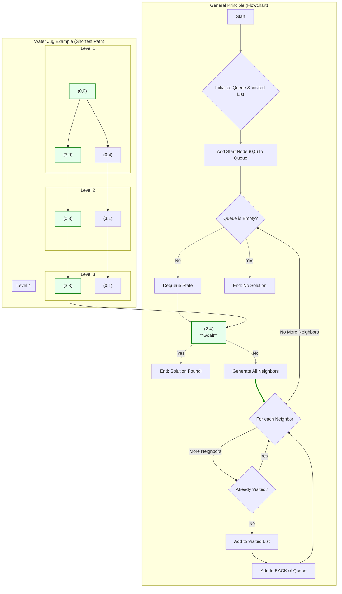

```mermaid
graph TD
    subgraph "General Principle (Flowchart)"
        direction LR
        A[Start] --> B{Initialize Queue & Visited List};
        B --> C["Add Start Node (0,0) to Queue"];
        C --> D{Queue is Empty?};
        D -- No --> E[Dequeue State];
        D -- Yes --> F[End: No Solution];
        E --> G{Is it Goal State?};
        G -- Yes --> H[End: Solution Found!];
        G -- No --> I[Generate All Neighbors];
        I --> J{For each Neighbor};
        J -- More Neighbors --> K{Already Visited?};
        K -- No --> L[Add to Visited List];
        L --> M[Add to BACK of Queue];
        M --> J;
        K -- Yes --> J;
        J -- No More Neighbors --> D;
    end

    subgraph "Water Jug Example (Shortest Path)"
        direction TB
        S["(0,0)"]
        subgraph "Level 1"
            S --> S1["(3,0)"];
            S --> S2["(0,4)"];
        end
        subgraph "Level 2"
            S1 --> S3["(0,3)"];
            S2 --> S4["(3,1)"];
        end
        subgraph "Level 3"
            S3 --> S5["(3,3)"];
            S4 --> S6["(0,1)"];
        end
        subgraph "Level 4"
            S5 --> G["(2,4) <br/> **Goal!**"];
        end
        
        linkStyle 0,1,2,3,4,5,6,7 stroke-width:1px, stroke:gray, fill:none;
        linkStyle 8 stroke-width:3px, stroke:green, fill:none;

        classDef path fill:#e6ffed,stroke:#228B22,stroke-width:2px;
        class S,S1,S3,S5,G path;
    end
```